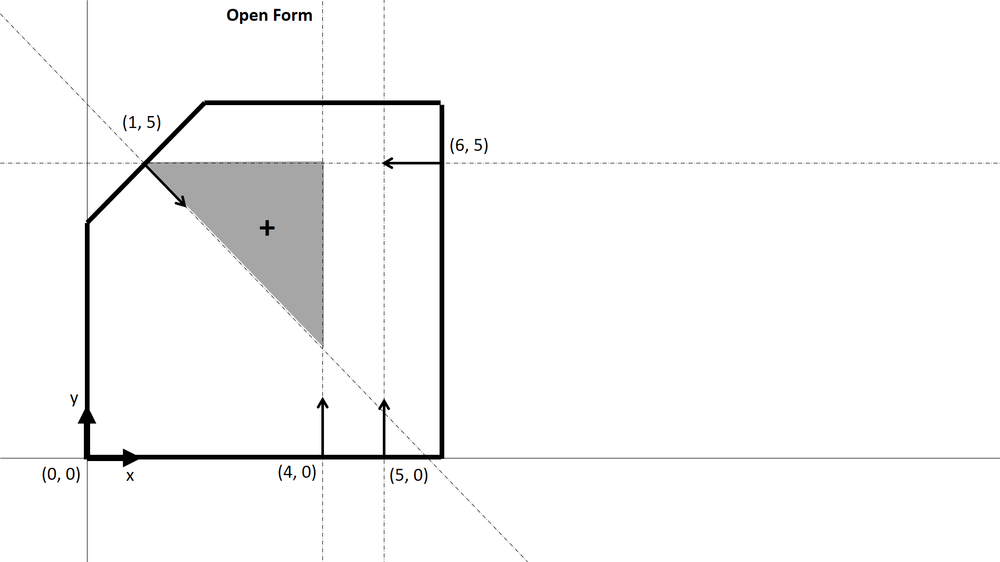
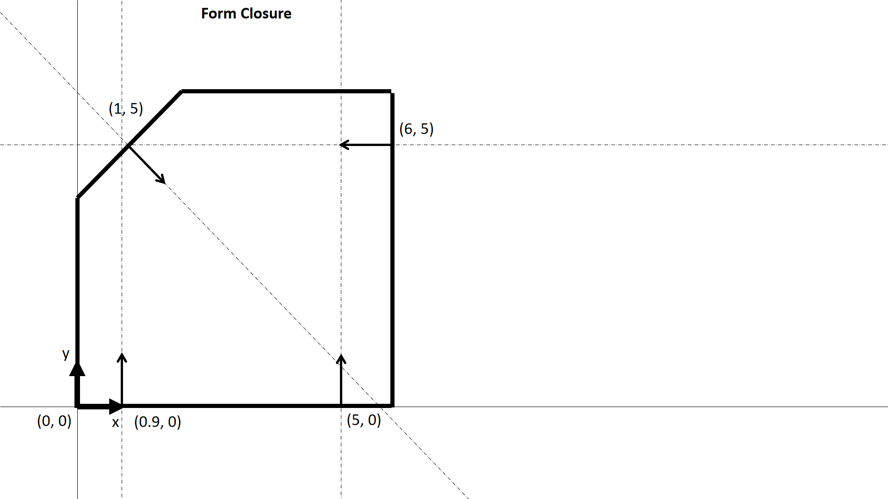

This program determines if a planar rigid body, subject to a specified set of stationary point contacts, is in form closure (using linear programming optimization).
As input program takes a CSV file with a list of contacts defined as (x, y) coordinates and its normal (in degrees).

Open form example:

Closed form example:

The body IS IN form closure. The solution - 'k' vector is: 
[39.99999565  1.00000002 40.99999554 57.98330576]
